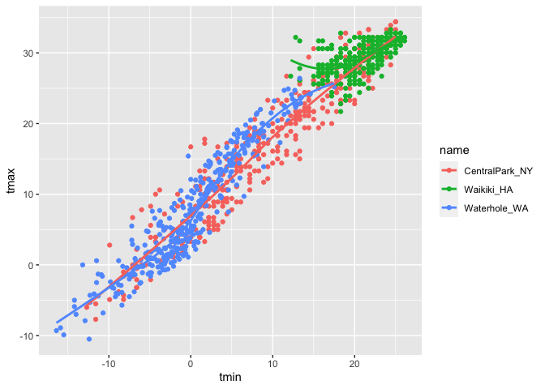
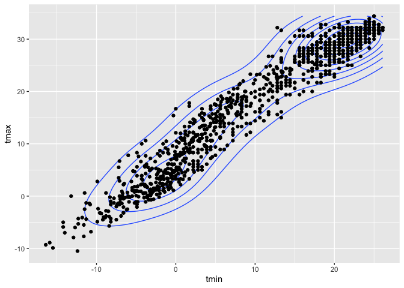
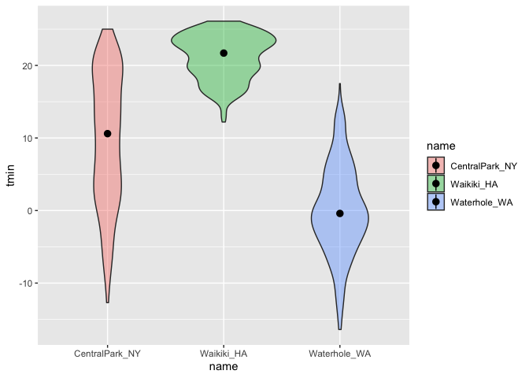
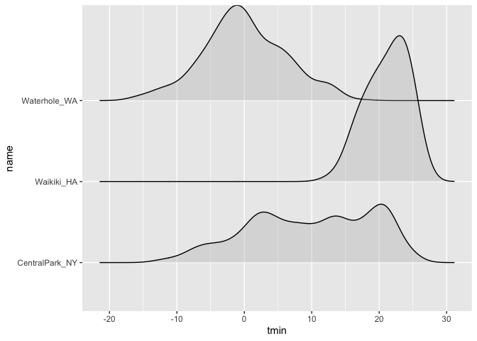
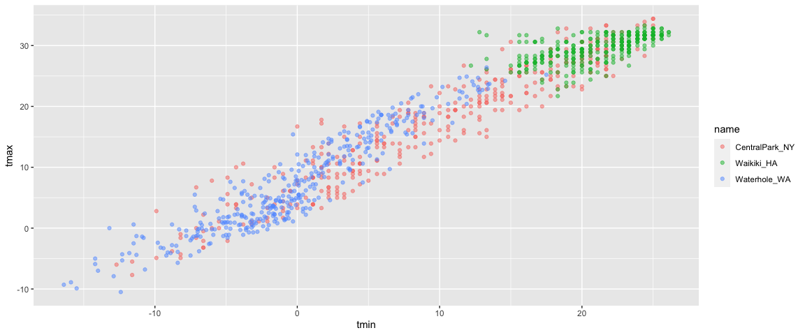

viz\_part\_1
================

``` r
library(tidyverse)
```

    ## ── Attaching packages ──────────────────────────────────────────────────────────────────── tidyverse 1.3.0 ──

    ## ✓ ggplot2 3.3.2     ✓ purrr   0.3.4
    ## ✓ tibble  3.0.3     ✓ dplyr   1.0.2
    ## ✓ tidyr   1.1.2     ✓ stringr 1.4.0
    ## ✓ readr   1.3.1     ✓ forcats 0.5.0

    ## ── Conflicts ─────────────────────────────────────────────────────────────────────── tidyverse_conflicts() ──
    ## x dplyr::filter() masks stats::filter()
    ## x dplyr::lag()    masks stats::lag()

``` r
library(ggridges)
```

\#\#Load the weather data

``` r
weather_df = 
  rnoaa::meteo_pull_monitors(
    c("USW00094728", "USC00519397", "USS0023B17S"),
    var = c("PRCP", "TMIN", "TMAX"), 
    date_min = "2017-01-01",
    date_max = "2017-12-31") %>%
  mutate(
    name = recode(
      id, 
      USW00094728 = "CentralPark_NY", 
      USC00519397 = "Waikiki_HA",
      USS0023B17S = "Waterhole_WA"),
    tmin = tmin / 10,
    tmax = tmax / 10) %>%
  select(name, id, everything())
```

    ## Registered S3 method overwritten by 'hoardr':
    ##   method           from
    ##   print.cache_info httr

    ## using cached file: /Users/akanksha/Library/Caches/R/noaa_ghcnd/USW00094728.dly

    ## date created (size, mb): 2020-10-04 08:12:57 (7.522)

    ## file min/max dates: 1869-01-01 / 2020-10-31

    ## using cached file: /Users/akanksha/Library/Caches/R/noaa_ghcnd/USC00519397.dly

    ## date created (size, mb): 2020-10-04 08:13:07 (1.699)

    ## file min/max dates: 1965-01-01 / 2020-03-31

    ## using cached file: /Users/akanksha/Library/Caches/R/noaa_ghcnd/USS0023B17S.dly

    ## date created (size, mb): 2020-10-04 08:13:11 (0.88)

    ## file min/max dates: 1999-09-01 / 2020-10-31

## Scatterplots

Create my first scatterplot

``` r
ggplot(weather_df,aes(x = tmin,y= tmax))+
  geom_point()
```

    ## Warning: Removed 15 rows containing missing values (geom_point).

<!-- -->

New approach, same plot.

``` r
weather_df %>% 
  ggplot(aes(x=tmin, y=tmax))+geom_point()
```

    ## Warning: Removed 15 rows containing missing values (geom_point).

<!-- --> Save and
edit a plot object.

``` r
weather_plot=
  weather_df %>% 
  ggplot(aes(x=tmin, y=tmax))

weather_plot+geom_point()
```

    ## Warning: Removed 15 rows containing missing values (geom_point).

<!-- --> \#\#
Advanced scatterplot…

Start with the same one and make it fancy

``` r
weather_df %>% 
  ggplot(aes(x= tmin, y = tmax, color= name))+
  geom_point()+
  geom_smooth(se=FALSE)
```

    ## `geom_smooth()` using method = 'loess' and formula 'y ~ x'

    ## Warning: Removed 15 rows containing non-finite values (stat_smooth).

    ## Warning: Removed 15 rows containing missing values (geom_point).

<!-- --> What
about `aes` placement..?

``` r
weather_df %>% 
 ggplot(aes(x= tmin, y = tmax))+
  geom_point(aes(color=name))+
  geom_smooth()
```

    ## `geom_smooth()` using method = 'gam' and formula 'y ~ s(x, bs = "cs")'

    ## Warning: Removed 15 rows containing non-finite values (stat_smooth).

    ## Warning: Removed 15 rows containing missing values (geom_point).

<!-- --> Let’s
facet some things\!

``` r
weather_df %>% 
  ggplot(aes(x= tmin, y = tmax, color= name))+
  geom_point(alpha= .2)+
  geom_smooth(se=FALSE)+
  facet_grid(. ~ name)
```

    ## `geom_smooth()` using method = 'loess' and formula 'y ~ x'

    ## Warning: Removed 15 rows containing non-finite values (stat_smooth).

    ## Warning: Removed 15 rows containing missing values (geom_point).

<!-- --> Let’s
combine some elements and try a new plot.

``` r
weather_df %>% 
  ggplot(aes(x=date, y=tmax, color=name))+
  geom_point(aes(size=prcp), alpha=0.5)+
  geom_smooth(se=FALSE)+
  facet_grid(. ~ name)
```

    ## `geom_smooth()` using method = 'loess' and formula 'y ~ x'

    ## Warning: Removed 3 rows containing non-finite values (stat_smooth).

    ## Warning: Removed 3 rows containing missing values (geom_point).

<!-- --> \#\#
Some small notes

How many geoms have to exist

``` r
weather_df %>% 
  ggplot(aes(x=tmin, y=tmax, color=name))+
  geom_smooth(se=FALSE)
```

    ## `geom_smooth()` using method = 'loess' and formula 'y ~ x'

    ## Warning: Removed 15 rows containing non-finite values (stat_smooth).

<!-- --> You can
use a neat geom\!

``` r
weather_df %>% 
  ggplot(aes(x=tmin, y=tmax))+
  geom_density2d()+
  geom_point()
```

    ## Warning: Removed 15 rows containing non-finite values (stat_density2d).

    ## Warning: Removed 15 rows containing missing values (geom_point).

<!-- --> \#\#
Univariate plots

Histograms are really great.

``` r
weather_df %>% 
  ggplot(aes(x=tmin))+
  geom_histogram()
```

    ## `stat_bin()` using `bins = 30`. Pick better value with `binwidth`.

    ## Warning: Removed 15 rows containing non-finite values (stat_bin).

<!-- -->

Can we add color…

``` r
weather_df %>% 
  ggplot(aes(x=tmin, fill= name))+
  geom_histogram()+
facet_grid(. ~ name)
```

    ## `stat_bin()` using `bins = 30`. Pick better value with `binwidth`.

    ## Warning: Removed 15 rows containing non-finite values (stat_bin).

<!-- --> Let’s
try a new geometry\!

``` r
weather_df %>% 
  ggplot(aes(x=tmin, fill=name))+
  geom_density(alpha=.3, adjust=.5)
```

    ## Warning: Removed 15 rows containing non-finite values (stat_density).

<!-- --> What
about boxplots??

``` r
weather_df %>% 
  ggplot(aes(x=name,y = tmin))+
  geom_boxplot()
```

    ## Warning: Removed 15 rows containing non-finite values (stat_boxplot).

<!-- -->

Trendy plots

``` r
weather_df %>% 
  ggplot(aes(x= name, y= tmin, fill=name))+
  geom_violin(alpha=0.4)+
  stat_summary(fun="median")
```

    ## Warning: Removed 15 rows containing non-finite values (stat_ydensity).

    ## Warning: Removed 15 rows containing non-finite values (stat_summary).

    ## Warning: Removed 3 rows containing missing values (geom_segment).

<!-- --> Ridge
plots– the most popular plot of 2017

``` r
weather_df %>% 
ggplot (aes(x= tmin, y= name))+
  geom_density_ridges(alpha=.3)
```

    ## Picking joint bandwidth of 1.67

    ## Warning: Removed 15 rows containing non-finite values (stat_density_ridges).

<!-- --> \#\#
Save and Embed

Let’s save a scatterplot

``` r
weather_plot=
weather_df %>% 
  ggplot(aes(x=tmin, y = tmax, color=name))+
  geom_point(alpha=0.5)

ggsave("./results/weather_plot.pdf", weather_plot, width=8, height=5)
```

    ## Warning: Removed 15 rows containing missing values (geom_point).

What about embedding…

``` r
weather_plot
```

    ## Warning: Removed 15 rows containing missing values (geom_point).

<!-- -->

``` r
weather_plot
```

    ## Warning: Removed 15 rows containing missing values (geom_point).

<!-- -->

Embed at different size

``` r
weather_plot
```

    ## Warning: Removed 15 rows containing missing values (geom_point).

<!-- -->
