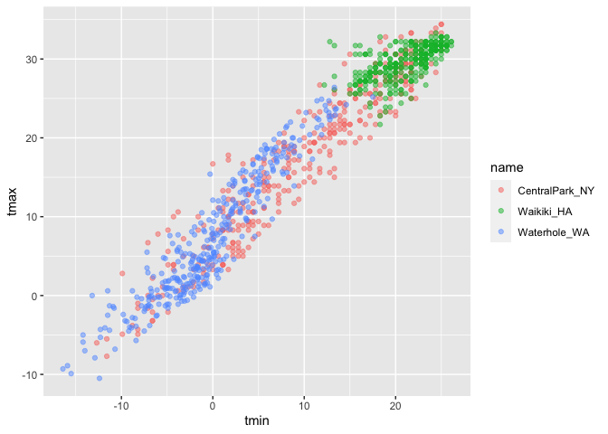
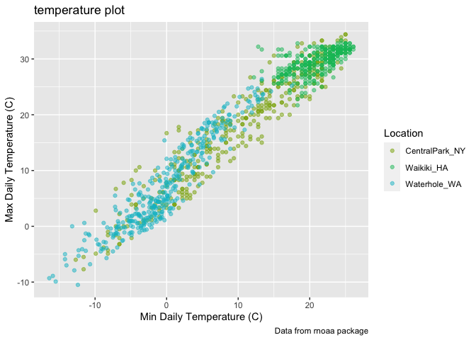

viz\_part
================

``` r
library(tidyverse)
```

    ## ── Attaching packages ───────────────────────────────────────────────────────────────────────────────────────────────────── tidyverse 1.3.0 ──

    ## ✓ ggplot2 3.3.2     ✓ purrr   0.3.4
    ## ✓ tibble  3.0.3     ✓ dplyr   1.0.2
    ## ✓ tidyr   1.1.2     ✓ stringr 1.4.0
    ## ✓ readr   1.3.1     ✓ forcats 0.5.0

    ## ── Conflicts ──────────────────────────────────────────────────────────────────────────────────────────────────────── tidyverse_conflicts() ──
    ## x dplyr::filter() masks stats::filter()
    ## x dplyr::lag()    masks stats::lag()

``` r
library(patchwork)
```

\#\#Load the weather data

``` r
weather_df = 
  rnoaa::meteo_pull_monitors(
    c("USW00094728", "USC00519397", "USS0023B17S"),
    var = c("PRCP", "TMIN", "TMAX"), 
    date_min = "2017-01-01",
    date_max = "2017-12-31") %>%
  mutate(
    name = recode(
      id, 
      USW00094728 = "CentralPark_NY", 
      USC00519397 = "Waikiki_HA",
      USS0023B17S = "Waterhole_WA"),
    tmin = tmin / 10,
    tmax = tmax / 10) %>%
  select(name, id, everything())
```

    ## Registered S3 method overwritten by 'hoardr':
    ##   method           from
    ##   print.cache_info httr

    ## using cached file: /Users/akanksha/Library/Caches/R/noaa_ghcnd/USW00094728.dly

    ## date created (size, mb): 2020-10-04 08:12:57 (7.522)

    ## file min/max dates: 1869-01-01 / 2020-10-31

    ## using cached file: /Users/akanksha/Library/Caches/R/noaa_ghcnd/USC00519397.dly

    ## date created (size, mb): 2020-10-04 08:13:07 (1.699)

    ## file min/max dates: 1965-01-01 / 2020-03-31

    ## using cached file: /Users/akanksha/Library/Caches/R/noaa_ghcnd/USS0023B17S.dly

    ## date created (size, mb): 2020-10-04 08:13:11 (0.88)

    ## file min/max dates: 1999-09-01 / 2020-10-31

``` r
weather_df
```

    ## # A tibble: 1,095 x 6
    ##    name           id          date        prcp  tmax  tmin
    ##    <chr>          <chr>       <date>     <dbl> <dbl> <dbl>
    ##  1 CentralPark_NY USW00094728 2017-01-01     0   8.9   4.4
    ##  2 CentralPark_NY USW00094728 2017-01-02    53   5     2.8
    ##  3 CentralPark_NY USW00094728 2017-01-03   147   6.1   3.9
    ##  4 CentralPark_NY USW00094728 2017-01-04     0  11.1   1.1
    ##  5 CentralPark_NY USW00094728 2017-01-05     0   1.1  -2.7
    ##  6 CentralPark_NY USW00094728 2017-01-06    13   0.6  -3.8
    ##  7 CentralPark_NY USW00094728 2017-01-07    81  -3.2  -6.6
    ##  8 CentralPark_NY USW00094728 2017-01-08     0  -3.8  -8.8
    ##  9 CentralPark_NY USW00094728 2017-01-09     0  -4.9  -9.9
    ## 10 CentralPark_NY USW00094728 2017-01-10     0   7.8  -6  
    ## # … with 1,085 more rows

## Remember this plot..?

``` r
weather_df %>% 
  ggplot(aes(x=tmin, y=tmax, color= name)) + 
  geom_point(alpha= .5)
```

    ## Warning: Removed 15 rows containing missing values (geom_point).

<!-- -->
\#\#Labels

``` r
weather_df %>% 
  ggplot(aes(x=tmin, y=tmax, color= name)) + 
  geom_point(alpha= .5) +
  labs(
    title="temperature plot",
    x="Min Daily Temperature (C)",
    y="Max Daily Temperature (C)",
    caption="Data from rnoaa package"
  )
```

    ## Warning: Removed 15 rows containing missing values (geom_point).

<!-- -->

## Scales

``` r
weather_df %>% 
  ggplot(aes(x=tmin, y=tmax, color= name)) + 
  geom_point(alpha= .5) +
  labs(
    title="temperature plot",
    x="Min Daily Temperature (C)",
    y="Max Daily Temperature (C)",
    caption="Data from rnoaa package"
  ) +
  scale_x_continuous(
    breaks= c(-15, 0, 15),
    labels=c("-15 C", "0", "15")
    
  )+
  scale_y_continuous(
    position="right"
  )
```

    ## Warning: Removed 15 rows containing missing values (geom_point).

<!-- --> \#\#
Look at color scales

``` r
weather_df %>% 
  ggplot(aes(x=tmin, y=tmax, color= name)) + 
  geom_point(alpha= .5) +
  labs(
    title="temperature plot",
    x="Min Daily Temperature (C)",
    y="Max Daily Temperature (C)",
    caption="Data from rnoaa package"
  )+
  scale_color_hue(
    name="Location",
    h=c(100,200))
```

    ## Warning: Removed 15 rows containing missing values (geom_point).

<!-- -->

## More colors

``` r
weather_df %>% 
  ggplot(aes(x=tmin, y=tmax, color= name)) + 
  geom_point(alpha= .5) +
  labs(
    title="temperature plot",
    x="Min Daily Temperature (C)",
    y="Max Daily Temperature (C)",
    caption="Data from rnoaa package"
  )+
  viridis::scale_color_viridis(
    name="Location",
    discrete=TRUE)
```

    ## Warning: Removed 15 rows containing missing values (geom_point).

<!-- --> \#\#
Themes

Shift the legend

``` r
weather_df %>% 
  ggplot(aes(x=tmin, y=tmax, color= name)) + 
  geom_point(alpha= .5) +
  labs(
    title="temperature plot",
    x="Min Daily Temperature (C)",
    y="Max Daily Temperature (C)",
    caption="Data from rnoaa package"
  )+
  viridis::scale_color_viridis(
    name="Location",
    discrete=TRUE)+
  theme(legend.position= "bottom")
```

    ## Warning: Removed 15 rows containing missing values (geom_point).

<!-- --> Shift
overall theme

``` r
weather_df %>% 
  ggplot(aes(x=tmin, y=tmax, color= name)) + 
  geom_point(alpha= .5) +
  labs(
    title="temperature plot",
    x="Min Daily Temperature (C)",
    y="Max Daily Temperature (C)",
    caption="Data from rnoaa package"
  )+
  viridis::scale_color_viridis(
    name="Location",
    discrete=TRUE)+
  theme_minimal()+
  theme(legend.position="bottom")
```

    ## Warning: Removed 15 rows containing missing values (geom_point).

<!-- --> \#\#
Setting options

``` r
library(tidyverse)

knitr::opts_chunk$set(
  fig.width=6,
  fig.asp= .6,
  out.width= "90%"
)
theme_set(theme_minimal()+theme(legend.position="bottom"))

options(
  ggplot2.continuous.color="viridis",
  ggplot2.continuous.fill= "viridis"
)

scale_color_discrete= scale_color_viridis_d
scale_fill_discrete= scale_color_viridis_d
```
